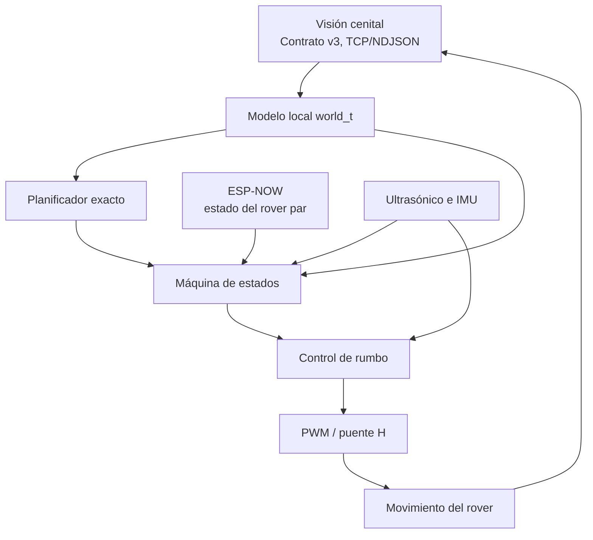
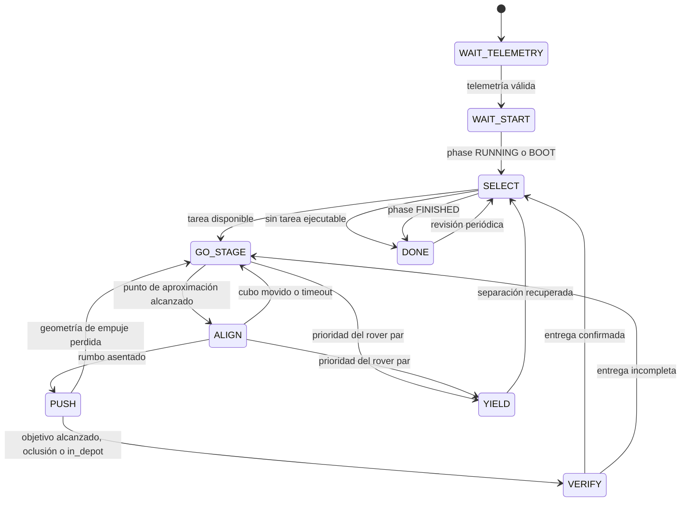

# Especificación técnica del firmware

**Equipo:** Felix  
**Integrantes:** Jennifer Vicentes Valle y Alejandro Espinoza Morales  
**Plataforma:** CenfoBot con ESP32 / IdeaBoard  
**Framework:** ESP-IDF mediante PlatformIO

## 1. Objetivo

El firmware coordina dos rovers para trasladar cubos de colores a sus depósitos. Cada rover recibe el estado global de la cancha, calcula su propia asignación, ejecuta la trayectoria y verifica la entrega. La computadora externa no envía órdenes de movimiento.

El diseño se divide en cuatro niveles:

1. adquisición del estado global;
2. asignación y secuenciación de tareas;
3. máquina de estados de misión y coordinación entre rovers;
4. control de movimiento y salida a motores.

## 2. Modelo del mundo

El cliente de visión se conecta a `VISION_HOST:2026` y consume mensajes NDJSON del protocolo v3. Cada mensaje reemplaza el estado anterior; no se procesa una cola histórica.

Convenciones geométricas:

- posiciones en celdas;
- una celda equivale a 20 mm;
- `col` aumenta hacia la derecha;
- `row` aumenta hacia abajo;
- `theta = 0°` apunta hacia `+col`;
- el ángulo positivo es antihorario y se normaliza a `[0°, 360°)`.

El modelo contiene rovers, cubos, depósitos, obstáculos, fase de la ronda y edades de observación. Las entidades se buscan por ID o color; el orden de los arreglos del contrato no se considera estable.

Una entrega solo se acepta cuando el campo `in_depot` del cubo es verdadero. Este valor incorpora la geometría y el tiempo de permanencia definidos por el sistema oficial; el firmware no reconstruye ese veredicto localmente.

### Vigencia de datos

| Condición | Valor |
|---|---:|
| Máxima edad de telemetría global | 700 ms |
| Máxima edad de una observación normal | 500 ms |
| Oclusión de cubo permitida durante empuje | 1000 ms |

Si la telemetría global o la pose propia vencen, los motores se ponen en cero.

## 3. Planificación de tareas

La tarea de planificación incluye dos decisiones: qué cubos atiende cada rover y en qué orden. El número de cubos está acotado por el contrato, por lo que se usa enumeración exacta en vez de una heurística.

Para $n$ cubos pendientes, el número de planes completos para dos rovers es:

$$
\sum_{k=0}^{n} {n \choose k} k!(n-k)! = (n+1)!
$$

Esto produce 24 planes para tres cubos y 120 para cuatro. Cada reparto se evalúa con todas las permutaciones internas de ambos rovers.

### Función de coste

El coste de una tarea suma:

- traslado desde la pose actual hasta el punto de aproximación;
- giro necesario para quedar alineado;
- recorrido de empuje hasta el depósito;
- tiempo fijo de alineación y verificación.

La solución minimiza primero el *makespan*:

$$
J = \min \max(T_{10}, T_{11})
$$

Como criterio secundario se minimiza $T_{10}+T_{11}$. Esto distribuye el trabajo según el tiempo de finalización del rover más lento.

Los cubos se ordenan por color y los rovers por ID antes de enumerar. Ambos equipos reciben el mismo mundo y aplican los mismos desempates, por lo que obtienen el mismo reparto sin un protocolo de negociación centralizado.

Si el otro rover no tiene una observación vigente, el rover visible planifica en solitario. Durante la aproximación se permite cambiar de objetivo únicamente si la mejora estimada supera cinco segundos. Una tarea que ya entró en empuje permanece comprometida salvo fallo físico o de seguridad.

## 4. Máquina de estados

Estados principales:

- `WAIT_TELEMETRY`: espera un estado válido de visión.
- `WAIT_START`: mantiene el rover detenido hasta el inicio.
- `SELECT`: calcula el plan y toma la primera tarea asignada.
- `GO_STAGE`: navega al punto situado detrás del cubo.
- `ALIGN`: espera la disipación de inercia y orienta el rover hacia el depósito.
- `PUSH`: mantiene el cubo centrado y verifica progreso.
- `VERIFY`: espera el veredicto oficial con la escena quieta.
- `YIELD`: despeja la trayectoria del rover prioritario.
- `DONE`: detención temporal con reevaluación periódica.

La tarea de misión corre cada 20 ms.

## 5. Geometría de aproximación y empuje

Sea $C$ la posición del cubo, $D$ el centro del depósito y:

$$
\hat{u}=\frac{D-C}{\lVert D-C\rVert}
$$

El punto de aproximación se define como:

$$
S=C-8\hat{u}
$$

El punto se limita al área útil del rover. Si el recorte contra el borde desplaza el punto más de dos celdas respecto a la línea de empuje, la tarea se aplaza porque no existe espacio suficiente para una aproximación directa.

Antes de empujar se exige:

- un segundo de asentamiento después de llegar;
- cubo desplazado menos de una celda durante la alineación;
- error angular dentro de 10°;
- velocidad angular menor a 10°/s;
- cubo por delante al menos 0.5 celdas;
- error lateral máximo de dos celdas.

El objetivo de empuje corresponde al centro del rover, no al centro del depósito:

$$
G=D-(4+2.5)\hat{u}
$$

Las 4 celdas representan la separación rover-cubo en contacto y las 2.5 celdas restantes compensan la rueda libre. Al alcanzar $G$, el rover se detiene y espera 1300 ms antes de evaluar `in_depot`.

Durante el empuje se mide cada 1200 ms la reducción de distancia entre cubo y depósito. Dos intervalos consecutivos con avance menor a una celda cancelan el intento y activan un reintento posterior.

## 6. Control de movimiento

### Control de rumbo en avance

La orientación absoluta proviene de la cámara y el giroscopio aporta amortiguamiento entre cuadros. La corrección diferencial es:

$$
u_c=\operatorname{sat}(K_p e_\theta-K_d\omega_z)\,s
$$

con:

- $e_\theta$: error angular normalizado a `[-180°, 180°]`;
- $\omega_z$: velocidad angular del giroscopio;
- $s$: signo de giro calibrado por rover.

Si $|e_\theta|>35°$, el rover gira en el sitio antes de avanzar. La salida vuelve al modo lineal cuando el error cae por debajo del 40 % de ese umbral, lo que introduce histéresis.

### Giro en el sitio

La magnitud se obtiene de `TURN_KP`, se limita entre 0.12 y 0.30 y recibe amortiguamiento giroscópico mediante `TURN_KD`. El giro termina solo cuando se cumplen simultáneamente la tolerancia angular y la velocidad de asentamiento.

### Velocidades

| Parámetro | Valor |
|---|---:|
| Crucero | 0.40 |
| Empuje | 0.38 |
| Aproximación sin carga | 0.12 |
| Aproximación con cubo | 0.15 |
| Radio de desaceleración normal | 15 celdas |
| Radio de desaceleración en empuje | 12 celdas |

El empuje conserva una velocidad mínima mayor para mantener par bajo carga.

### Calibración por rover

| Rover | Motor izquierdo invertido | Motor derecho invertido | Signo CCW |
|---|---:|---:|---:|
| 10 | 0 | 1 | +1 |
| 11 | 1 | 1 | +1 |

La diferencia corresponde al cableado y al montaje físico. Los valores no se derivan por simetría.

## 7. Coordinación entre rovers

Cada rover publica por ESP-NOW, cada 150 ms:

- ID;
- color reclamado;
- distancia al objetivo;
- posición;
- indicador de alineación o empuje.

Un anuncio caduca a los 800 ms. La posición de visión se usa como respaldo geométrico cuando está más fresca, mientras que el indicador `pushing` se conserva únicamente cuando existe enlace directo vigente.

### Reclamo de tarea

Si ambos reclaman el mismo color, tiene prioridad:

1. el rover que ya está empujando;
2. el rover más cercano por más de 0.5 celdas;
3. el rover con ID menor en caso de empate.

### Prioridad de paso

Dentro de 12 celdas de separación:

- un rover no comprometido cede ante un par que empuja;
- si ninguno empuja, cede el ID mayor;
- durante el empuje propio, si el par llega a ocho celdas, el ID mayor se detiene.

Cuando el par empuja y su orientación es vigente, el punto de cesión se calcula lateralmente a su rumbo. Se prueban ambos lados y se descartan rutas bloqueadas por cubos. Sin orientación válida se usa separación radial y, si el borde o un cubo la impiden, se prueban alternativas perpendiculares. Si no existe una salida segura, el rover permanece detenido.

La asimetría por ID evita que ambos apliquen la misma maniobra de cortesía al mismo tiempo.

## 8. Tratamiento de obstáculos y conflictos

### Cubos en la ruta

Antes de llegar al punto de aproximación se calcula la distancia de cada cubo al segmento de trayectoria. Si el espacio libre es menor que el radio del rover más la media diagonal aproximada del cubo, se genera un punto lateral.

El desvío permanece fijo mientras el cubo bloqueador no cambie de posición. Esto evita que el objetivo se desplace alrededor del obstáculo a medida que avanza el rover. Si el bloqueador se mueve o pierde vigencia, el desvío se calcula nuevamente.

### Cubos en el corredor de empuje

Antes y durante el empuje se comprueba el segmento entre el cubo objetivo y su depósito. Otro cubo dentro del margen de seguridad bloquea la maniobra. Esta condición evita empujar un cubo contra otro o intentar ingresar a un depósito ocupado por el color equivocado.

### Ultrasónico

El sensor se usa durante `GO_STAGE` con umbral de 7 cm. Un eco coherente con la posición del cubo objetivo no bloquea la aproximación. El ultrasónico se omite durante `PUSH` porque el cubo transportado ocupa permanentemente el campo frontal del sensor.

## 9. Reintentos y límites temporales

| Mecanismo | Política |
|---|---|
| Tiempo máximo de una tarea | 60 s |
| Tarea junto al borde | aplazamiento de 10 s |
| Reactivación por movimiento del cubo | desplazamiento mínimo de 1 celda |
| Fallo físico repetido | 15 s por número de fallo |
| Máximo aplazamiento por fallos | 60 s |
| Histéresis de cambio de objetivo | 5 s |

Un cubo difícil no se descarta de forma permanente. El aplazamiento permite que el otro rover avance en tareas ejecutables y que un cambio observado en la cancha reactive el cubo antes de vencer el temporizador.

## 10. Seguridad de motores

El puente H se controla con PWM de 50 Hz y resolución de 10 bits. La banda muerta se remapea para utilizar de forma continua el intervalo útil del motor.

La parada usa cero en las cuatro entradas del puente H. El frenado activo con ambas entradas altas no se utiliza porque no produjo un estado eléctrico seguro en el hardware probado. En consecuencia, el control compensa la rueda libre mediante:

- desaceleración gradual;
- tiempos de asentamiento;
- objetivo de empuje adelantado;
- verificación visual posterior.

## 11. Indicadores y diagnóstico

El registro de misión se emite a 2 Hz e incluye estado, pose, rumbo objetivo, error, distancia, posición y edad del cubo. Las transiciones se registran de forma independiente.

El LED WS2812 resume el estado:

- rojo: detenido;
- amarillo: conexión o espera;
- verde: navegación o verificación;
- azul: alineación o empuje;
- magenta: cesión de paso.

Los cinco modos de prueba aíslan motores, avance recto, sensores, visión y giro. El firmware normal siempre debe mostrar `SELFTEST = 0` al arrancar.

## 12. Alcance y limitaciones

- La estrategia de manipulación es exclusivamente por empuje; un cubo pegado al borde puede no disponer de espacio de aproximación.
- Los obstáculos publicados por visión se almacenan en el modelo, pero la ruta global implementada evita cubos, rovers y ecos ultrasónicos; no ejecuta planificación geométrica general alrededor de polígonos arbitrarios.
- El control depende de marcadores visibles y de una latencia de red acotada.
- El modelo de coste usa velocidades nominales; la verificación de progreso corrige fallos de ejecución, pero no elimina patinaje ni variaciones de batería.
- La lógica final de coordinación y reintentos compila para ambos rovers, pero requiere una prueba integral en cancha antes de considerarse validada para competencia.
